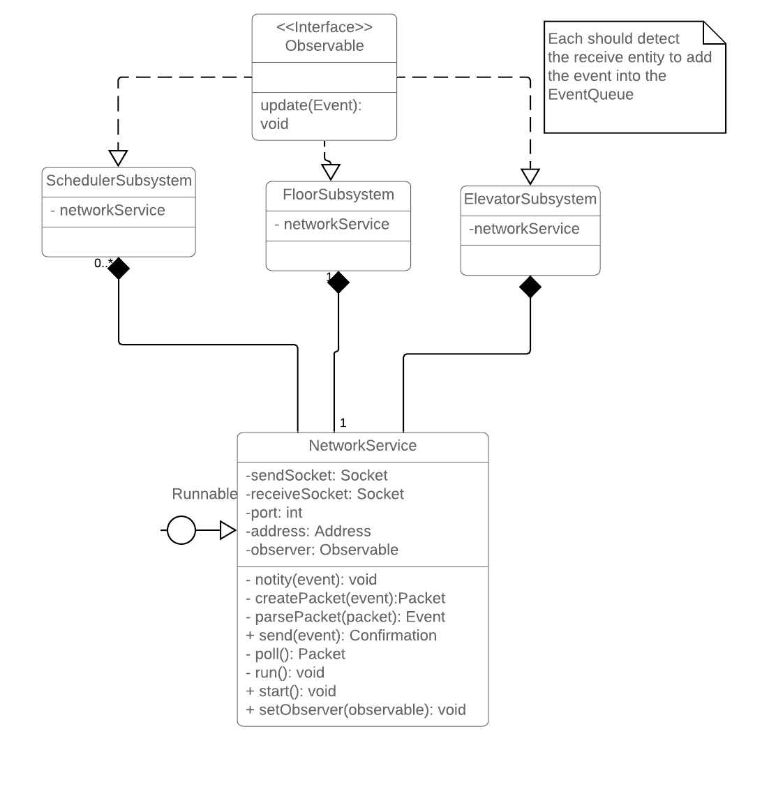

# SYSC 3303 - Iteration 3

## Main tasks

1. Add RPC - UDP
2. Add multiple elevators
  1. Change the elevators system similar to the floor
  2. Update scheduler algorithm
  3. Update controller board
  4. Update Floor system

## RPC - UDP

We need to upgrade the communication methods between the subsystems

### The addition of NetworkService 

- Encapsulate all network operations
- It is a thread itself, 1 for each subsystem
- Require subsystems to implement Observable 

### List of communication methods:

Need to change all of these methods to make use of `NetworkService`

- [SchedulerSubsystem](./src/main/java/sysc/g1/scheduler/SchedulerSubsystem.java):
  - [notifyFloor(event)](https://github.com/TrCaM/Elevator-system/blob/bdc6ccdfe7a10795fa8868fe06399c76f9529980/src/main/java/sysc/g1/scheduler/SchedulerSubsystem.java#L27):
  - [notifyElevator(event)](https://github.com/TrCaM/Elevator-system/blob/bdc6ccdfe7a10795fa8868fe06399c76f9529980/src/main/java/sysc/g1/scheduler/SchedulerSubsystem.java#L32):
- [FloorSubsystem](./src/main/java/sysc/g1/floor/FloorSubsystem.java):
  - floorToScheduler(event)
  - schedulerToFloor(event)
- [EvelatorSubsystem](./src/main/java/sysc/g1/elevator/ElevatorSubsystem.java):
  - elevatorToScheduler(event)
  - schedulerToFloor(event)

### Transform Event to Datagram:

- [x] From Event -> byte[]: ByteArrayOutputStream
- [x] Everything inside Event must implement Serializable
- [x] From byte to Datagram
- [x] Vice versa

### Upgrading scheduler:

- Based on A3's intermediate host, use 2 threads:
  - 1 thread for floor subsystem's communication
  - 1 thread for elevator subsystem's communication

### Add main:

- Add main for each subsystem to start independently
- Remove actor simulator test

## Add Multiple Elevators:

### Sunday updates:

- Move the elevator button press from Elevator to ElevatorSubsystem
- Add multiple elevators on ElevatorSubSystem
- Add more direction lamps for elevators in FloorSubsystem
- Parse Id and send event to the proper elevator
- Event Handlers:
  - ElevatorArriveHandler:
    - On Floor: update direction lamp for that specific elevator
    - On Scheduler: Update so that it also fulfill that specific elevator request beside floor requests
  - ElevatorDoorOpenHandler:
    - On Floor: Update FloorRequestInfo to contain information about the elevator which is interacting with a floor
    - On Scheduler: Not thing changed
  - Elevator(Up/Down)Handler: simple check if the event is sent to the correct floor
  - ElevatorPendingHandler:
    - Update controller board
    - Implementing
    - Testing

### Use elevator ID instead of hardcode 

### ElevatorSubsystem changes

- Use the current floor subsystem as an example, transform single elevator instance -> list of elevator
  - Add totalElevators variable
  - Change start method
  - implement getElevator(int id)
  - Implement schedulerToElevator -> Need to parse the target id -> get elevator from id
  - ElevatorEvent -> Add elevator id to 
- Elevator changes:
  - Add unique id for each instance of elevator
  - Should not change the rest since the actions are controlled by the scheduler
  - Need to add proper target id in both send and receive: change createElevatorEvent 

- Elevator events:
- Handler change:
  - Make sure that the target id is right, otherwise trash the event
  - FloorLoadingReadyHandler: Make sure the right elevator need to receive this
  - ElevatorUp, ElevatorDown, ElevatorContinuePassing: Make sure to pass the right ID for ElevatorArrive

### SchedulerSubsystem changes

- Change controller board:
  - Now keep track of running position and direction of all elevators
  - **BIGGGGG**: Separate floor request vs elevator requests
  - Each elevator should have their own array of elevator requests
    - Try to fulfill FloorRequest while executing Elevator requests

- Event handler changes:
  - ElevatorRequestHandler: Store request for that ONE elevator in the control board (easy)
  - ElevatorPendingHandler (IMPORTANT):
    - Need to send the event to the proper pending elevator
    - Check the algorithm section
  - FloorLoadingReadyHandler:
    - Make sure the the right elevator need to receive this (should not do anything big)

### FloorSubsystem changes

- Have each door for each elevator
- Array of:
  - Direction lamps
- Event handler changes: 
  - ElevatorArrive: Make sure to update the direction lamp of the correct elevator
  - ElevatorStopHandler: Make sure the the right elevator will receive FloorLoadingReady event
  - DoorOpenHandler: Make sure the the right elevator will receive FloorLoadingFinish event 

### Changes for UDP:

- Old tests should be broken, but there are ways to fix:
    - Since we're using UDP to communicate between subsystems, it is no longer feasible (actually yes, but complicated) to check scheduler's pending events. 
    Therefore, we need to remove tests that use `schedulerSubsystem.pendingEvents()`
    - In order to reuse the ports, every handlers tests should now use `@BeforeClass` instead of `@Before`.
        - Why? ->  [@Before vs @BeforeClass](https://stackoverflow.com/questions/20295578/difference-between-before-beforeclass-beforeeach-and-beforeall)
        - Also, `@BeforeClass` requires variables to be static. For example, please take a look at `ElevatorActivateHandlerTest.java`

### Changes in algorithm to support multiple elevators:

- All changes should be in ElevatorPendingHandler
- What changes? -> Decide what elevator to fulfill the floor request
  1. All idle, receive first floor request: which should move?
    - Find the closest elevator to the request and ask it to move
  2. Request to go up/down from a floor:
    - If there is a another elevator is moving up/down to that floor -> pick up the request
  3. Elevator 1 from 2->7, Elevator 2 from: 3-> 9, floor request at 5: (**Elevator 2** should pick it)
  4. IMPORTANT: Request in elevator must be fulfilled first, do not try to fulfill conflict floor request
  5. Floor Request coming 
    - Look for moving elevator that could pick up conveniently
    - Check for Idle elevators -> can it pick up faster than the moving elevators 

